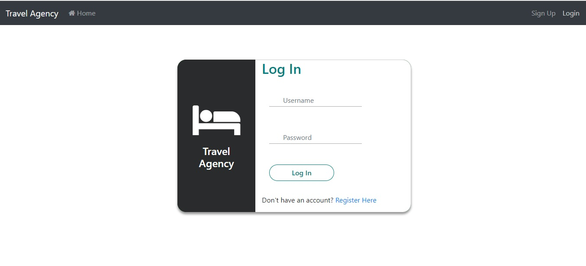

# Travel agency 
The Travel agency is simple implementation of Online Hotel
Reservation System.

This project made of 3 separate Docker containers that holds:
-	PostgreSQL database
-	Java backend (Spring Boot)
-	Angular frontend

## Running the application
     
STEP1:

First we need to install docker for windows (or linux)

Download Docker : https://www.docker.com/get-started

Then open powershell with Administrator privilege and check ,
```
docker info
```
STEP2:

Git clone my project from my GitHub repository:
```
$ git clone https://github.com/VovaProtsiv/travelagency
```

STEP3:

In the terminal enter the root folder of the project and type the command:

```
$ docker-compose up
```
Now, you need to wait couple minutes so all 3 Docker containers will be up and running. After that you’ll be able to enter a frontend in a browser with a link: http://localhost:4200.

STEP4:

If you want to stop it, use the following command:
```
$ docker-compose down
```

## How to usage the Travel Agency

The entry point for a user is a website which is available under the address: http://localhost:4200/



I created the data.sql file in the src / main / resources folder, and it will be executed automatically at startup.

### Credentials:

| Name          | Password  | Role      |
| ------------- |:---------:| :---------|
| Ivan          | 111111    | User      |
| Vova          | 222222    | Moderator |
| Petro         | 333333    | Admin     |


### All authenticated users can 

-	find hotels in different cities 
-	check if there are available rooms in hotel for period
-	book available rooms on the concrete date

### Manager additional can

-	add hotels in the system
-	add rooms to the hotel

### Admin additional can

-	view all users and their orders


